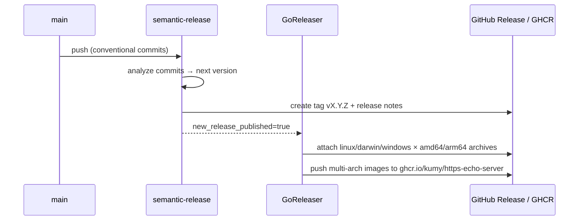

# Development

## Repository layout

```
cmd/https-echo-server/   entrypoint
internal/               implementation packages (see the specification)
docs/                   this documentation (zensical)
.github/workflows/      CI, release, docs pipelines
Dockerfile              standalone multi-stage build
Dockerfile.goreleaser   runtime-only image used by the release pipeline
```

## Everyday commands

```shell
make help          # list all targets
make build         # build ./bin/https-echo-server (version injected via ldflags)
make test          # go test -race -shuffle=on with coverage
make cover         # HTML coverage report
make lint          # golangci-lint (config: .golangci.yml)
make fmt           # gofmt + goimports
make docker-build  # multi-stage image build
make docs-serve    # zensical live preview on :8000
make snapshot      # goreleaser snapshot (dist/, no publishing)
make tools         # install golangci-lint + goreleaser
```

## CI (`.github/workflows/ci.yml`)

Runs on every PR and push to `main`:

| Job | What |
| --- | --- |
| Lint | golangci-lint v2 (`.golangci.yml`) |
| Test | `make test` (race detector, shuffled), coverage artifact |
| Build | `make build` + `goreleaser check` |
| Docker build | multi-stage image build (no push) |
| Commit messages | commitlint on PRs (Conventional Commits) |

## Releases (`.github/workflows/release.yml`)

Fully automated on push to `main` — **never tag manually**:



- Version bumps come from commit types (`fix:` → patch, `feat:` → minor,
  `!`/`BREAKING CHANGE` → major) — see
  [CONTRIBUTING](https://github.com/kumy/https-echo-server/blob/main/CONTRIBUTING.md).
- semantic-release config: `.releaserc.json`; GoReleaser config:
  `.goreleaser.yaml` (release mode `keep-existing` so the notes generated by
  semantic-release are preserved).

## Documentation (`.github/workflows/docs.yml`)

The site is built with [zensical](https://zensical.org/) from `docs/` +
`zensical.toml` and deployed to GitHub Pages on every push to `main` touching
docs. Local preview:

```shell
uvx zensical serve      # or: pip install zensical && zensical serve
```

!!! note "One-time repo setup"
    In the GitHub repository settings, set **Pages → Source → GitHub
    Actions**, and allow GitHub Actions to create releases (default
    `GITHUB_TOKEN` permissions are declared in the workflows).

## Dependency updates

Dependabot watches Go modules, GitHub Actions, and the Dockerfile base images
weekly, using conventional-commit prefixes so its merges release correctly
(`chore(deps)` → no release; promote to `fix(deps)` manually when an update
should ship).
