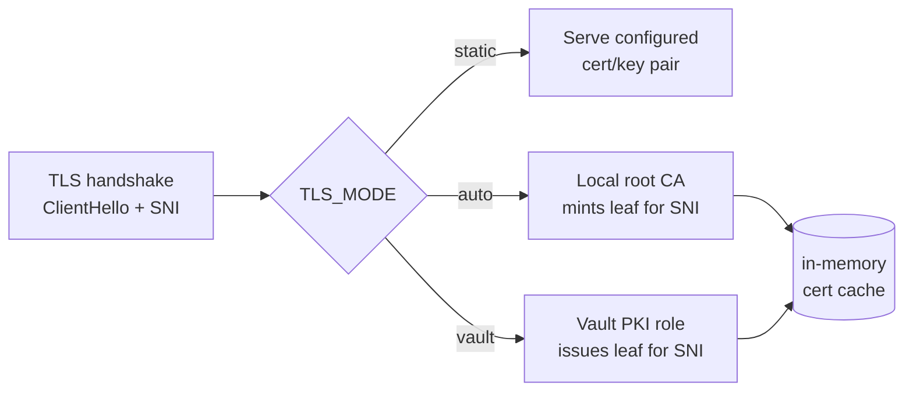

# TLS

The TLS listener supports three mutually exclusive modes, selected with
`TLS_MODE` (default: `auto`).



## `static` — bring your own pair

```shell
TLS_MODE=static \
HTTPS_CERT_FILE=/etc/tls/fullchain.pem \
HTTPS_KEY_FILE=/etc/tls/privkey.pem \
https-echo-server
```

- The certificate file may contain the full chain (leaf first).
- The pair is loaded at startup; a broken pair is a fatal startup error.
- The same certificate is served regardless of SNI.

With Docker:

```shell
docker run -p 8443:8443 --rm -t \
  -v /path/to/certs:/etc/tls:ro \
  -e TLS_MODE=static \
  -e HTTPS_CERT_FILE=/etc/tls/fullchain.pem \
  -e HTTPS_KEY_FILE=/etc/tls/privkey.pem \
  ghcr.io/kumy/https-echo-server
```

## `auto` — on-the-fly CA (default)

On first start the server:

1. Generates a root CA (ECDSA P-256, 10-year validity, CN
   `https-echo-server Root CA`).
2. **Prints the CA certificate PEM to stdout** (disable with
   `TLS_CA_PRINT=false`).
3. Saves the CA to `TLS_CA_CERT_FILE` / `TLS_CA_KEY_FILE`
   (default `certs/ca.crt` / `certs/ca.key`; `/certs/...` in Docker). On
   subsequent starts the existing CA is reused, so trust it once.

During each TLS handshake, a **leaf certificate matching the client's SNI** is
signed by that CA on the fly and cached in memory (LRU, `TLS_CERT_CACHE_SIZE`
entries, `TLS_CERT_TTL` validity):

- SNI `foo.example.com` → certificate with DNS SAN `foo.example.com`
- No SNI (e.g. connection by IP) → certificate for `localhost`, the host's
  hostname, `127.0.0.1` and `::1`

### Trusting the CA

=== "curl"

    ```shell
    curl --cacert certs/ca.crt https://localhost:8443/
    ```

=== "Firefox"

    *Settings → Privacy & Security → Certificates → View Certificates →
    Authorities → Import* — select `ca.crt`, tick *Trust this CA to identify
    websites*.

=== "Chrome / system (Linux)"

    ```shell
    sudo cp certs/ca.crt /usr/local/share/ca-certificates/https-echo-server.crt
    sudo update-ca-certificates
    ```

=== "macOS"

    ```shell
    sudo security add-trusted-cert -d -r trustRoot \
      -k /Library/Keychains/System.keychain certs/ca.crt
    ```

### The CA download endpoint

Unless disabled, the CA certificate is served on the **plaintext** listener at
`TLS_CA_ENDPOINT` (default `/ca`):

```shell
curl -o ca.crt http://localhost:8080/ca
```

This path is excluded from echoing. Set `TLS_CA_ENDPOINT=""` to disable it.

!!! danger "Not for production trust"
    The auto CA is a debugging convenience. Anyone who can read the CA key
    file can impersonate any server towards clients that trusted the CA.
    Keep its scope to test machines.

## `vault` — HashiCorp Vault as PKI

Same on-the-fly SNI behaviour as `auto`, but leaf certificates are issued by a
Vault **PKI secrets engine** instead of a local CA:

```shell
TLS_MODE=vault \
VAULT_ADDR=https://vault.internal:8200 \
VAULT_TOKEN=hvs.XXXX \
VAULT_PKI_MOUNT=pki_int \
VAULT_PKI_ROLE=echo \
https-echo-server
```

For each new SNI, the server calls
`POST {VAULT_ADDR}/v1/{VAULT_PKI_MOUNT}/issue/{VAULT_PKI_ROLE}` with the SNI
as `common_name` and `VAULT_PKI_TTL` as `ttl`, then caches the returned
certificate until ~2/3 of its lifetime has elapsed (then re-issues).

The CA chain reported by Vault is printed at startup (`TLS_CA_PRINT`) and
served on the CA endpoint (`TLS_CA_ENDPOINT`), exactly like `auto` mode.

### One-time Vault setup (example)

```shell
vault secrets enable -path=pki_int pki
vault secrets tune -max-lease-ttl=87600h pki_int
vault write pki_int/root/generate/internal \
  common_name="echo test CA" ttl=87600h

vault write pki_int/roles/echo \
  allow_any_name=true \
  enforce_hostnames=false \
  allow_ip_sans=true \
  max_ttl=72h

# Minimal token policy
vault policy write echo-issuer - <<'EOF'
path "pki_int/issue/echo" {
  capabilities = ["create", "update"]
}
EOF
vault token create -policy=echo-issuer
```

### Failure behaviour

- Vault unreachable / issuance denied → the TLS **handshake for that SNI
  fails** and the error is logged; other SNIs served from cache keep working.
- Vault is **not** contacted at startup except to fetch the CA chain
  (`GET /v1/{mount}/ca_chain`) for printing/serving; a failure there is logged
  as a warning, not fatal.

## mTLS echo

With `MTLS_ENABLE=true` the server *requests* (but does not require or
verify) a client certificate during the handshake, and echoes its details:

```shell
curl -k --cert client.crt --key client.key https://localhost:8443/
```

```json
{
  "clientCertificate": {
    "subject": "CN=my-client",
    "issuer": "CN=some-ca",
    "serial": "0F:32:...",
    "notBefore": "2026-01-01T00:00:00Z",
    "notAfter": "2027-01-01T00:00:00Z",
    "fingerprintSHA256": "ab:cd:..."
  }
}
```

!!! note
    Certificate details are echoed **without validation** — this is a
    debugging aid, not an authentication mechanism.
